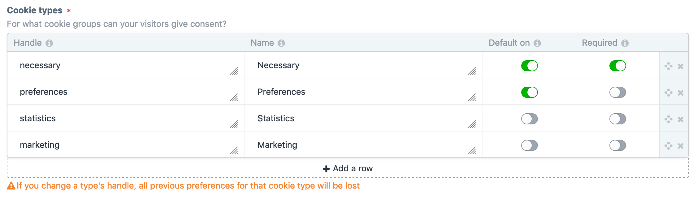
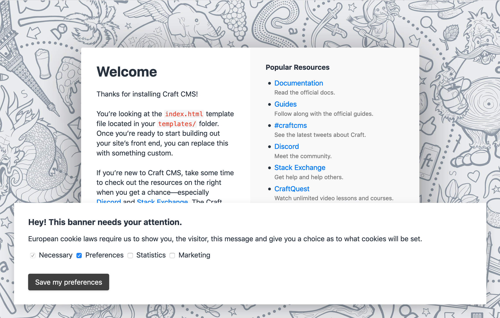

# Complete Cookie Consent plugin for Craft CMS 3.x

This plugin will help you comply with [EU Cookie law](https://www.privacypolicies.com/blog/eu-cookie-law/). As that law states, all European visitors of your site should not only be made aware of, but also consent to the cookies your site sets. This plugin will help you obtain consent for one or more cookie groups.

## Requirements

This plugin requires Craft CMS 3.0.0 or later.

**Installation**

1. Install with Composer via `composer require nilsenpaul/craft-complete-cookie-consent` from your project directory
2. Install plugin in the Craft Control Panel under Settings > Plugins
3. Alter the plugin's settings to cater to your site's needs

You can also install Complete Cookie Consent via the **Plugin Store** in the Craft Control Panel.

## Setup
Using the plugin's settings page, you have total control over the appearance and functionality of your cookie consent banner:

  * Activate and de-activate the banner from the plugin settings page
  * Only show the banner for logged in admins, for testing purposes
  * Change the colors of the banner and banner button
  * Change the text of the banner title, banner text and button text
  * Include the plugin's CSS to give your banner a base style, or use your own CSS
  * Choose a position for the banner: top, right, bottom, left or center
  * Change the name and expiration time for the preferences cookie
  * Change cookie types, make cookie types required or checked by default
  * Add geolocation to your cookie consent process by using an automatically downloaded GeoIpLite database, or by adding an [ipApi](https://ipapi.com/) API key: only show the banner to EU visitors
  

## Usage

After you've installed the plugin, and activated the cookie consent banner, the banner will be shown on your site. Depending on your setup, an external geolocation API will be used to determine if a cookie banner is needed. 

### Consent mode (implied/explicit)
The Complete Cookie Consent plugin lets you choose between two consent modes: Implied and Explicit. With implied consent, the cookie banner will only be shown on every visitor's first page load. With explicit consent, the visitor will have to make a choice before the banner disappears.

#### What should I choose?
This is *NOT* legal advice. It's hard to find out what rules apply to your website, especially because every European country has its own set of rules (or no rules or enforcement whatsoever). If you want to play safe, go for explicit consent. If you decide to go for implied consent, make sure you [create a form](#updating-cookie-consent-preferences-with-your-own-form) on your site for visitors to change their preferences.

### Honoring your visitor's cookie preferences

Cookie consent wouldn't be of much use if you wouldn't act upon the preferences of your users. That's why the `ccc` JavaScript object is set, containing the preferences of the current visitor:

    console.log(ccc.consentSubmitted)
    # prints true or false. Only true if visitor submitted their preferences
    
    console.log(ccc.consentImplied)
    # prints true or false. True if consent mode is set to 'implied' and the visitor did not submit their own preferences
    
    console.log(ccc.consent.[cookieTypeHandle])
    # prints true or false, depending on your visitor's choice (or the default settings, if consent mode is 'implied')
    
You can use these values to load (or prevent loading of) whatever you want.

### Cookie Consent variable
The plugin provides a template variable, to get the current visitor's consent info:

    
    
    {{ consentInfo.consentSubmitted }}{# <-- true or false #}
    {{ consentInfo.consent }}{# <-- An array with cookieType handles as keys, and consent status as value #}

### Updating cookie consent preferences with your own form
As of v1.0.1, it's possible to update consent preferences for a visitor with a form like this:

    <form method="POST">
        <input type="hidden" name="action" value="complete-cookie-consent/consent/submit" />
        {{ csrfInput() }}
 
        
            <label for="cookieTypes[consentType]">
                <input type="checkbox" name="cookieTypes[]" value="{{ consentType }}" checked /> {{ consentType }}
            </label>
        
 
        <input type="submit" value="Submit" />
    </form>

## Thank you!

  * [NYStudio107](https://github.com/nystudio107), for all the work you put in your plugins and the blog posts you write. Writing plugins is easier with your code as guidance.

## TO-DO
 * More JS examples, for example how to prevend Google Tag Manager from loading if consent is not given
 * Simple statistics, to know how the cookie banner effects your site
